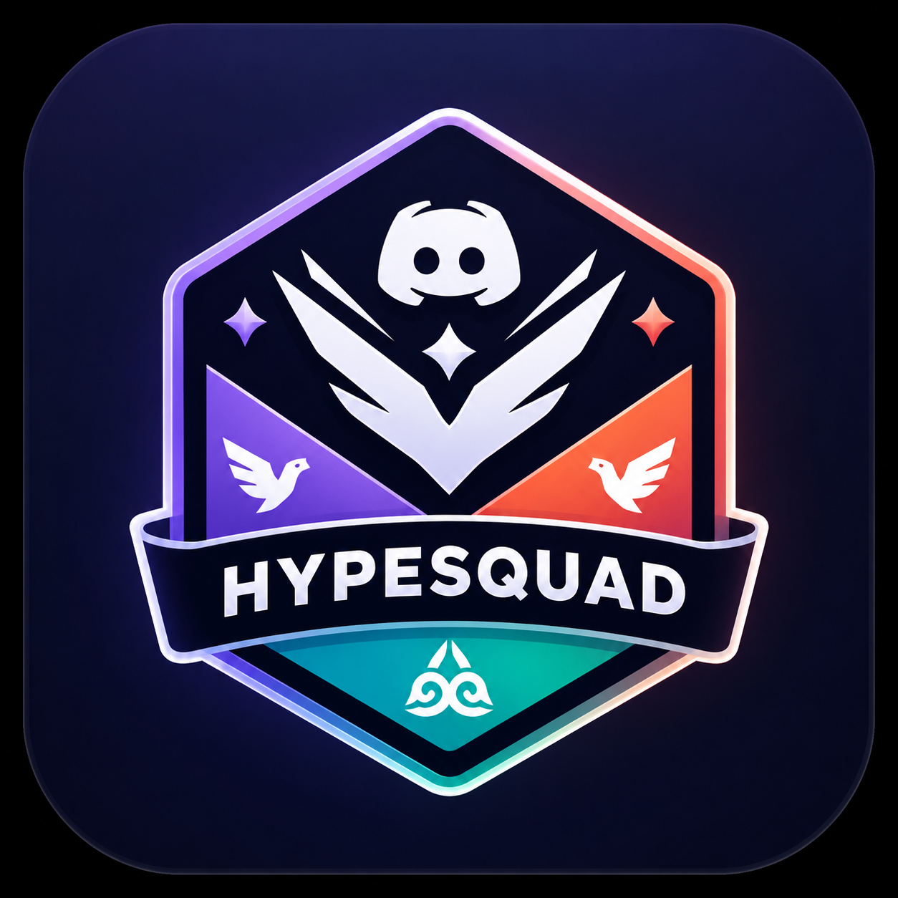

# ⚡ Discord HypeSquad Selector

A simple and fast browser extension / script that allows you to easily change or set your **Discord HypeSquad Badge** directly from Discord Web.

---

## ✨ Features
- 🚀 **Easy HypeSquad Selection:** Choose between **Bravery**, **Brilliance**, or **Balance** with a single click.
- 🎨 **Native Discord UI:** Integrates seamlessly into Discord's modal design with custom animations and toasts.
- 🛡️ **Safe & Lightweight:** Runs completely locally in your browser.

---

## 🛠️ Installation

### Option 1: Browser Extension (Chrome / Brave / Edge / Opera)

1. **Download** or clone this repository to your computer:
   - Click green **Code** button -> **Download ZIP**, then extract it.
2. Open your browser and go to the Extensions page:
   - Chrome / Brave: `chrome://extensions`
   - Edge: `edge://extensions`
   - Opera: `opera://extensions`
3. Enable **Developer Mode** (top right corner toggle).
4. Click **Load Unpacked** (*Załaduj rozszerzenie bez opakowania*) in the top left corner.
5. Select the extracted folder containing `manifest.json`.
6. Open [Discord Web](https://discord.com/app), wait **3-5 seconds**, and the HypeSquad modal will automatically pop up!

---

### Option 2: Tampermonkey / Userscript

If you prefer using **Tampermonkey** or **Violentmonkey**:
1. Copy the code from `content.js` (or `script.user.js`).
2. Create a new user script in your manager, paste the code, and save it.
3. Reload Discord Web!

---

## 📸 Preview

Select your house directly within Discord's native modal popup:
- 💜 **House of Bravery**
- 💚 **House of Balance**
- 🧡 **House of Brilliance**

---

## 👥 Credits

Created with ❤️ by **woooosp** & **zuzakicia**.

---

### ⚠️ Disclaimer
*This project is for educational purposes only. It is not affiliated with, sponsored by, or endorsed by Discord Inc.*
